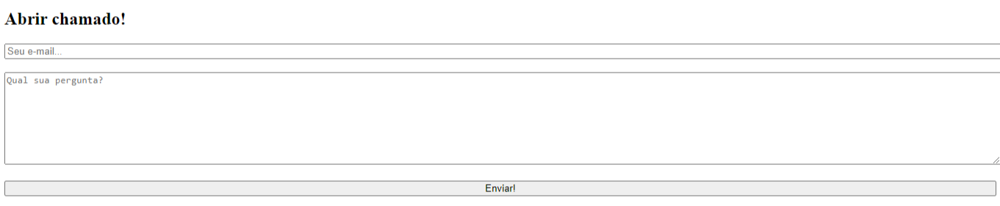
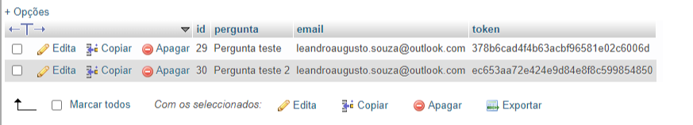

# WEBAPP DE SUPORTE DESENVOLVIDO EM PHP COM MVC.

Um Webapp de suporte desenvolvido em PHP com MVC para suporte.

- O usuário insere o e-mail e digita a mensagem.
- Após isso recebe um e-mail com um token para verificação e um link para acessar as interações com o suporte.

## Imagens do App

 

## Feito Com:

## 🔖 Licença

### Support Ou Contato

Copyright © 2022 leandroaugusto-souza

